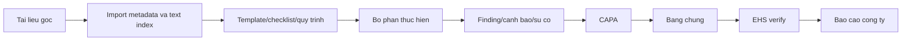

# Kien truc de xuat tu tai lieu ATVSLD - 6S

Ngay lap: 2026-06-08

Pham vi: doc cac tai lieu trong `G:\MHChub\tai lieu`, rut ra nghiep vu Safety - 6S va de xuat tich hop vao MHChub. Khong doi layout `/` va khong doi dashboard `/safety-6s` neu chua duoc phe duyet.

Nguyen tac hien thi tai lieu:

- Ten tai lieu hien thi theo file goc: `originalName`, `fileName`, sau do moi den `title`.
- Khong dich ten tai lieu, khong tu doi nhan tai lieu khi hien thi cho nguoi dung.
- Metadata phan loai chi dung cho loc/tim kiem/he thong, khong thay the ten file goc.

## Trang thai doc noi dung

Da quet duoc 24 file trong `tai lieu`.

Da chay OCR/document full ngay 2026-06-08:

- Manifest moi nhat: `G:\MHChub\output\safety-ocr-full-v2\manifest-2026-06-08T16-22-19-319Z.json`.
- Text da tach: `G:\MHChub\output\safety-ocr-full-v2\text`.
- Ket qua: 24/24 tai lieu da index duoc noi dung, 85 chunks.
- Da dong bo vao MySQL: `documents` co 24 tai lieu source `safety-document-import` deu `ocr_status = indexed`; `safety_document_text_chunks` co 85 chunks.
- File `.DOC` PCCC da doc duoc bang `word-extractor`, khong can LibreOffice/Word.
- Canh bao ky thuat: PDF.js co warning JBIG2 WASM, nhung render/OCR van hoan tat; 2 file tong quan ATVSLD - 6S OCR chat luong thap, can xem lai anh/PDF goc khi chuyen thanh quy tac.

| Nhom | Tai lieu | Trang thai | Nhan xet nghiep vu |
| --- | --- | --- | --- |
| 6S hang ngay | `Bieu kiem tra 6S hang ngay.pdf` | Da index bang OCR | Nen map vao checklist hang ngay theo bo phan/khu vuc. |
| Cham diem 6S | `EHS- QT-11 -Quy trình chấm điểm 6S.pdf` | Da index bang OCR | Nen map vao audit/cham diem 6S. |
| 6S hang ngay | `EHS- QT-12- Quy trinh thuc hien 6S.pdf` | Da index bang OCR | Nen map vao checklist 6S va lich thuc hien. |
| Cai tien an toan | `EHS- QT-14 - Quy trình cải tiến an toàn, 6S.pdf` | Da index bang OCR | Nen map vao CAPA/action va quy trinh cai tien. |
| Cham diem 6S | `Kiểm tra an toàn, 6S... hàng ngày.xlsx` | Da index | Co danh sach bo phan/ngay/ket qua kiem tra, can parser bang tot hon de lay cau hoi va diem. |
| Cham diem 6S | `Phiếu chấm điểm 6S (sản xuất, gián tiếp).pdf` | Da index bang OCR | Nen tao template diem rieng cho san xuat va gian tiep. |
| PCCC | `Biểu kiểm tra an toàn lao động,  PCCC (1.4.2026).pdf` | Da index bang OCR | Nen map vao module PCCC/ATLD inspection. |
| PCCC | `Biểu KT an toàn PCCC từ 01.10.2025.pdf` | Da index bang OCR | Nen map vao checklist PCCC theo ky ap dung. |
| PCCC | `Nội quy PCCC và quy định sử dụng điện UPDATE.DOC` | Da index bang word-extractor | Nen map vao quy dinh PCCC va an toan dien. |
| Y te | `1. Biểu kiêm tra định kỳ vật tư y tế áp dụng từ tháng 06. 2024.pdf` | Da index bang OCR | Nen map vao kiem ke tui so cuu/vat tu y te. |
| Y te | `1. HƯỚNG DẪN SỬ DỤNG PHÒNG Y TẾ.pdf` | Da index | Co luong su dung phong y te, lien he PY/PY2, EHS, GA, thoi gian su dung. |
| Y te | `3. Bảng tổng hợp nhu cầu kê mua vật tư y tế.xlsx` | Da index | Co du lieu nhu cau mua vat tu, can parser bang de lay danh muc/so luong. |
| Y te | `Phác đồ.pdf` | Da index bang OCR | Nen dua vao tra cuu noi bo/y te, khong bien thanh quy trinh thao tac neu chua duyet EHS/Y te. |
| Y te | `QUY ĐỊNH VỀ TÚI SƠ CỨU TẠI NƠI LÀM VIỆC.docx` | Da index | Co quy dinh tui so cuu theo so lao dong, yeu cau toi thieu va kiem tra thuong xuyen. |
| Y te | `Tổng hợp y tế từ T4.2025 - T4.2026.xlsx` | Da index | Co thong ke benh/ca kham theo thang va nha may, nen map vao report y te. |
| Hop an toan | `22期MHC安全衛生委員会議事録 202605 22 (ベトナム語日本語併記) -最終版_(PY2).docx` | Da index | Co noi dung hop cong ty, tai nan, KYT, viec giao bo phan, link file theo doi. |
| ATV | `ATV T3 2026.pdf` | Da index bang OCR | Nen map vao mang luoi an toan vien theo bo phan. |
| KYT | `BÁO CÁO KẾT QUẢ KIỂM TRA KYT THÁNG 05.2026.docx` | Da index | Co chu de kiem tra hoa chat, danh sach doan, van de chi ra, khuyen nghi cai tien. |
| KYT | `KYT Tháng 05.2026 Bộ phận RF.xlsx` | Da index | Co cau truc KYT Step 1, Step 2, muc tieu hanh dong, chi tay doc ten. |
| 3S | `Tiêu chuẩn 3S 18.11.2023.pdf` | Da index bang OCR | Nen map vao tieu chuan S1-S3 va thu vien hinh anh/tieu chi. |
| Tong quan ATVSLD - 6S | `20260608132400491.pdf` | Da index bang OCR, chat luong thap | Can xem PDF goc truoc khi chuyen thanh quy tac. |
| Tong quan ATVSLD - 6S | `20260608132520655.pdf` | Da index bang OCR, chat luong thap | Can xem PDF goc truoc khi chuyen thanh quy tac. |
| Tu kiem tra ATVSLD | `EHS-QT-06- Biểu 2- Mẫu biên bản tự kiểm tra an toàn vệ sinh lao động - vn.docx` | Da index | Co mau bien ban: dai dien doan, dai dien co so/bo phan, noi dung, ket luan, ky ten. |
| Tu kiem tra ATVSLD | `EHS-QT-06- Quy trình tự kiểm tra an toàn vệ sinh lao động -VN_Đã ký.pdf` | Da index bang OCR | Nen map vao quy trinh tu kiem tra cua bo phan/EHS. |

## Mo hinh 3 cap

### Cap cong ty

Cong ty can nhin duoc tinh trang toan nha may va cac hoat dong co tinh dieu hanh chung:

- Ban hanh quy dinh, tieu chuan, noi quy, bien ban hop an toan.
- Theo doi tai nan lao dong, medical room, PCCC, KYT, 6S, CAPA va dao tao.
- Tong hop bao cao theo thang/quy/nam, theo nha may PY/PY2, theo division/bo phan.
- Theo doi cac viec duoc giao trong hop an toan den tung bo phan.

### Cap EHS

EHS la chu quan quy trinh va nguoi review:

- Quan ly template checklist/audit: 6S, PCCC, tu kiem tra ATVSLD, KYT.
- Review ket qua bo phan nop len, yeu cau bo sung bang chung, xac minh dong CAPA.
- Ban hanh/cap nhat tai lieu, theo doi OCR/index, version, ngay hieu luc.
- Lap ma tran dao tao bat buoc theo bo phan/vi tri.
- Lap bao cao chuyen de: KYT, PCCC, y te, ATV, 6S, CAPA.

### Cap bo phan

Bo phan la noi phat sinh du lieu hang ngay:

- Thuc hien checklist 6S/PCCC/tu kiem tra theo lich.
- Tao canh bao/su co/KYT finding va CAPA noi bo.
- Cap nhat bang chung, anh truoc/sau, han hoan thanh.
- Xac nhan viec duoc giao tu hop an toan hoac tu EHS.
- Theo doi dao tao/ATV cua bo phan minh.

## De xuat trang web

### 1. Trang nen tao moi

| Route de xuat | Ten nghiep vu | Tai lieu nguon | Cap dung chinh | Ly do nen tach trang |
| --- | --- | --- | --- | --- |
| `/safety-6s/kyt` | KYT - Luong truoc nguy hiem | Bao cao KYT 05.2026, KYT RF xlsx | Bo phan, EHS | KYT co luong rieng: Step 1 hien trang, Step 2 ban chat nguy hiem, giai phap, muc tieu hanh dong, chi tay doc ten. |
| `/safety-6s/pccc` | PCCC va an toan dien | Checklist PCCC, noi quy PCCC/dien | Cong ty, EHS, Bo phan | PCCC can lich kiem tra, checklist rieng, khu vuc/tiet bi, loi qua han, bang chung, EHS xac nhan. |
| `/safety-6s/medical` | Y te va so cuu | Huong dan phong y te, tui so cuu, vat tu y te, tong hop y te | Cong ty, EHS/Y te, Bo phan | Y te co du lieu rieng: ca kham, phong y te, tui so cuu, vat tu, de xuat mua hang. |
| `/safety-6s/self-inspection` | Tu kiem tra ATVSLD | EHS-QT-06 procedure/form | Bo phan, EHS | Tu kiem tra la bien ban/lap doan/ket luan/ky ten, khac voi checklist 6S hang ngay. |
| `/safety-6s/meetings` | Hop an toan | Bien ban hop MHC 05.2026 | Cong ty, EHS, Bo phan | Hop an toan sinh ra viec giao, quyet dinh, deadline va bao cao hoan thanh. |
| `/safety-6s/atv-network` | Mang luoi an toan vien | ATV T3 2026 | Cong ty, EHS, Bo phan | ATV la master nguoi/bo phan/dao tao/trach nhiem, nen tach khoi training thong thuong. |

Uu tien neu khong muon sidebar dai: lam truoc 4 trang `KYT`, `PCCC`, `Y te/So cuu`, `Tu kiem tra ATVSLD`; `Meetings` va `ATV Network` co the la tab trong `Reports/Training` giai doan dau.

### 2. Trang da co nen mo rong

| Trang hien co | Nen bo sung tu tai lieu |
| --- | --- |
| `/safety-6s/documents` | Loc theo nhom goc: 6S hang ngay, Cham diem 6S, KYT, PCCC, Y te, Tu kiem tra, Hop an toan, ATV, Tong quan. Them trang thai OCR/converter, version, ngay hieu luc, tai lieu thay the. |
| `/safety-6s/checklist` | Them checklist 6S hang ngay theo EHS-QT-12, theo bo phan/khu vuc/ca/ngay, co anh bang chung. |
| `/safety-6s/audits` | Them audit/cham diem 6S theo EHS-QT-11 va phieu cham diem san xuat/gian tiep. |
| `/safety-6s/actions` | Gan voi EHS-QT-14: moi loi audit/KYT/PCCC/tu kiem tra tao CAPA, co han, owner, bang chung, EHS verify. |
| `/safety-6s/training` | Gan yeu cau dao tao KYT, PCCC, so cuu, 6S, ATV theo bo phan/vi tri. |
| `/safety-6s/reports` | Them bao cao theo chuyen de: 6S score, CAPA overdue, KYT findings, PCCC issues, medical cases, training valid rate. |
| `/safety-6s/locations` | Gan QR cho khu vuc checklist/audit/PCCC/tui so cuu. |
| `/safety-6s/warnings` va `/safety-6s/incidents` | Gan link tai lieu/quy trinh lien quan, tu dong de xuat CAPA va training lien quan. |

## Luong nghiep vu de xuat

## Module chi tiet

### KYT

Nguon da doc:

- Bao cao KYT 05.2026 co chu de "kiem tra an toan khi su dung bao quan hoa chat", danh sach doan kiem tra, khu vuc, bo phan phu trach, van de chi ra, khuyen nghi cai tien.
- File KYT RF co cau truc Step 1, Step 2, muc do quan trong, giai phap, muc tieu hanh dong nhom, chi tay doc ten.

De xuat chuc nang:

- Tao dot KYT theo thang/bo phan/chu de.
- Nhap thanh vien nhom va vai tro: truong doan, thu ky, thanh vien.
- Step 1: hien trang/nguy co tiem an.
- Step 2: ban chat nguy hiem/risk point, danh dau muc uu tien.
- Bien phap, muc tieu hanh dong, chi tay doc ten.
- EHS review va tao CAPA tu muc nguy hiem.
- Bao cao KYT theo bo phan, chu de, thang.

### PCCC va an toan dien

Nguon da OCR/converter:

- Hai bieu kiem tra PCCC da OCR duoc.
- Noi quy PCCC va quy dinh su dung dien dang la `.DOC`, da index duoc bang `word-extractor`.

De xuat chuc nang:

- Template checklist PCCC theo ky ap dung.
- Lich kiem tra theo khu vuc/bo phan.
- Danh sach hang muc: binh chua chay, loi thoat hiem, tu dien, day dan, bien bao, vat can.
- Anh bang chung, muc do nghiem trong, deadline.
- Bo phan xac nhan hoan thanh, EHS verify lai.
- Link sang CAPA neu loi khong dong dung han.

### Y te va so cuu

Nguon da doc:

- Huong dan su dung phong y te: doi tuong ap dung, phieu dang ky, phong y te lam viec 06:00-22:00, lien he PY/PY2, EHS, GA, huong xu ly.
- Quy dinh tui so cuu: so luong tui theo so lao dong, toi thieu moi mat bang/tang/khu vuc, khong dung tui cho vat dung khac, kiem tra thuong xuyen.
- Tong hop y te T4.2025 - T4.2026: nhom benh/ca kham theo thang va nha may.

De xuat chuc nang:

- So theo doi phong y te: ca kham, doi tuong, bo phan, huong xu ly.
- Quan ly tui so cuu theo khu vuc/QR: loai tui, so lao dong phu trach, tinh trang vat tu, lan kiem tra gan nhat.
- De xuat mua vat tu y te tu bang nhu cau.
- Dashboard y te: top nhom benh, xu huong thang, PY/PY2, vat tu sap het.
- Quyen nhap du lieu rieng cho Y te/EHS, bo phan chi xem va tao yeu cau.

### Tu kiem tra ATVSLD

Nguon da doc:

- Mau bien ban tu kiem tra ATVSLD co thong tin cong ty/bo phan, ngay lap, dai dien doan kiem tra, dai dien co so/bo phan, noi dung, ket luan, ky ten.
- Quy trinh EHS-QT-06 da OCR duoc, co noi dung muc dich, pham vi, luu trinh, thong bao truoc 07 ngay, trach nhiem bo phan va an toan ve sinh vien.

De xuat chuc nang:

- Tao dot tu kiem tra theo bo phan/ky.
- Nhap thanh phan doan kiem tra va dai dien bo phan.
- Noi dung kiem tra, ket qua, hinh anh, ket luan.
- Tao finding/CAPA tu diem khong phu hop.
- Xuat/in bien ban theo form goc.

### Hop an toan

Nguon da doc:

- Bien ban hop MHC 05.2026 co nguoi tham du/vang mat, noi dung su tham gia bac si, hien trang tai nan/su co, KYT, viec ra soat tu dien/hop ky thuat, link file theo doi.

De xuat chuc nang:

- Tao ky hop theo thang.
- Quan ly nguoi tham du/vang mat theo vai tro.
- Ghi agenda, quyet dinh, viec giao.
- Moi viec giao co bo phan phu trach, han hoan thanh, bang chung, trang thai.
- Lien ket den CAPA/KYT/PCCC neu viec giao thuoc chuyen de do.

### Mang luoi ATV

Nguon da OCR:

- `ATV T3 2026.pdf` da OCR duoc noi dung quyet dinh bo nhiem an toan vien.

De xuat chuc nang:

- Danh sach an toan vien theo bo phan/line/khu vuc.
- Trang thai dao tao va ngay het han.
- Phan cong ho tro checklist/KYT/tu kiem tra.
- Bao cao bo phan nao thieu ATV hop le.

## Data model de xuat them sau khi duyet

Bang da co va nen tai su dung:

- `documents`, `safety_document_text_chunks`
- `safety_audit_templates`, `safety_audit_questions`, `safety_audits`, `safety_audit_answers`
- `safety_actions`
- `safety_locations`
- `safety_training_requirements`, `safety_training_records`
- `safety_audit_logs`

Bang nen them:

- `safety_kyt_sessions`, `safety_kyt_members`, `safety_kyt_findings`
- `safety_pccc_inspections`, `safety_pccc_items`
- `safety_medical_visits`, `safety_first_aid_kits`, `safety_medical_inventory`, `safety_medical_inventory_requests`
- `safety_self_inspections`, `safety_self_inspection_members`, `safety_self_inspection_findings`
- `safety_meetings`, `safety_meeting_attendees`, `safety_meeting_tasks`
- `safety_atv_members`

Nguyen tac lien ket:

- Moi finding tu KYT/PCCC/tu kiem tra/audit co the tao `safety_actions`.
- Moi action co `source_type`, `source_id`, owner, deadline, bang chung, EHS verify.
- Moi trang chuyen de co the gan `document_id` de truy nguoc tai lieu/quy trinh goc.
- QR/khu vuc dung `safety_locations` de khong trung lap voi checklist/audit/PCCC/tui so cuu.

## API de xuat them sau khi duyet

KYT:

- `GET/POST /api/kyt-sessions`
- `GET/PATCH /api/kyt-sessions/:id`
- `POST /api/kyt-sessions/:id/submit`
- `POST /api/kyt-findings/:id/create-action`

PCCC:

- `GET/POST /api/pccc-inspections`
- `PATCH /api/pccc-inspections/:id`
- `POST /api/pccc-inspections/:id/submit`
- `POST /api/pccc-inspections/:id/review`

Y te:

- `GET/POST /api/medical-visits`
- `GET/POST /api/first-aid-kits`
- `GET/POST /api/medical-inventory-requests`
- `POST /api/first-aid-kits/:id/check`

Tu kiem tra:

- `GET/POST /api/self-inspections`
- `PATCH /api/self-inspections/:id`
- `POST /api/self-inspections/:id/submit`
- `POST /api/self-inspections/:id/review`

Hop an toan va ATV:

- `GET/POST /api/safety-meetings`
- `POST /api/safety-meetings/:id/tasks`
- `PATCH /api/safety-meeting-tasks/:id`
- `GET/POST /api/atv-members`

## De xuat UI/UX

Nguyen tac chung:

- Khong tao sidebar thu hai. Nav van sinh tu `AppShell.tsx`.
- Dashboard `/safety-6s` giu nguyen neu chua duoc phe duyet.
- Cac trang moi viet TSX lazy route trong `SafetyOperationsModule.tsx`.
- Giao dien mobile-first, table co `overflow-x-auto`, an cot phu o mobile.
- Nut lap lai dung icon lucide va tooltip: xem, sua, phe duyet, tu choi, upload bang chung, in/export.
- Ten file/tai lieu hien thi theo goc, khong dich.

Huong sidebar de khong qua dai:

- Giai doan 1: them 4 trang vao nhom "Nghiep vu an toan": KYT, PCCC, Y te/So cuu, Tu kiem tra.
- Giai doan 2: neu dung nhieu moi tach Hop an toan va Mang luoi ATV; ban dau co the dat la tab trong Reports/Training.

## Lo trinh tich hop

### Giai doan 1 - Chuan hoa tai lieu

- Sua metadata mojibake trong import/classify.
- Giu title goc khi hien thi.
- Dua ket qua OCR/document extraction vao DB khi MySQL dang chay bang `npm run data:ocr-safety-documents -- --update-db`.
- Tao trang thai tai lieu: indexed, reviewed, low_confidence; giu converter_required cho dinh dang legacy khac neu phat sinh.

### Giai doan 2 - Template nghiep vu

- Chuyen 6S, PCCC, KYT, tu kiem tra thanh template cau hoi/hang muc.
- Tach template san xuat/gian tiep neu phieu diem 6S yeu cau.
- Gan template voi document goc va version.

### Giai doan 3 - Trang chuyen de

- Lam `/safety-6s/kyt`.
- Lam `/safety-6s/pccc`.
- Lam `/safety-6s/medical`.
- Lam `/safety-6s/self-inspection`.

### Giai doan 4 - Bao cao va phan quyen

- Bao cao cong ty/EHS/bo phan.
- Quyen EHS review, leader xac nhan, bo phan cap nhat bang chung.
- Audit log cho moi thao tac quan trong.

## Dieu can ban duyet truoc khi code

1. Co them rieng 4 trang `KYT`, `PCCC`, `Y te/So cuu`, `Tu kiem tra ATVSLD` vao sidebar khong?
2. `Hop an toan` va `Mang luoi ATV` nen tach trang rieng ngay hay de trong tab `Reports/Training` truoc?
3. Co cho phep minh dua ket qua index 24/24 tai lieu vao DB local bang `--update-db` khi MySQL dang chay khong?
4. Co cho phep them migration bang moi cho KYT/PCCC/Y te/Tu kiem tra khong?
